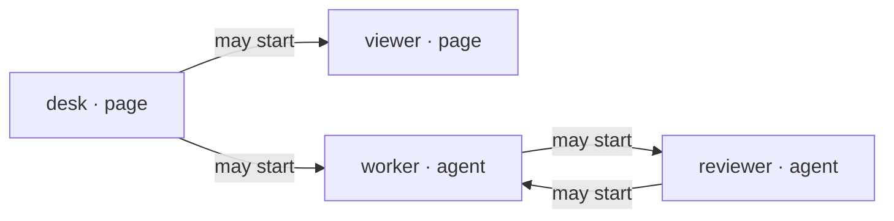

<section class="lesson">

## Grant the right to start—not a physical connection

Each participant has a private token and a directed `allow` list. desk may start toward viewer or worker. worker and reviewer may each start toward the other. No one may initiate toward desk. A reply to desk is still possible.

<protocol-diagram aria-label="Permission diagram only: desk may initiate to viewer and worker; worker and reviewer may initiate to each other. These arrows are not physical connections.">



</protocol-diagram>

### Prepare a private example router

Run from a source checkout with the router's documented Python dependencies already available. The commands below are manual setup instructions—not actions taken by this guide. Use a new private directory, outside every public root. Setup refuses to overwrite an existing config.

```
# From the repository root; keep this shell's PRIVATE value for serve.
umask 077
PRIVATE="$(mktemp -d "${TMPDIR:-/tmp}/anatomy-router.XXXXXXXX")"
uv run --offline --no-project --script .agents/tools/message-router/message_router.py setup \
  --config-file "$PRIVATE/router.json" \
  --page desk --page viewer --agent worker --agent reviewer \
  --allow desk:viewer --allow desk:worker \
  --allow worker:reviewer --allow reviewer:worker

uv run --offline --no-project --script .agents/tools/message-router/message_router.py serve \
  --config-file "$PRIVATE/router.json" --endpoint-dir "$PRIVATE/endpoints" --port 8787
```

<div class="result">

### Expected setup

Setup creates private configuration with distinct random tokens. Serve binds `127.0.0.1:8787` and only then writes mode-0600 endpoint records. Setup alone starts no server or clients. Missing offline dependencies are a prerequisite to resolve separately, not permission to download.

</div>

<details>

<summary>

Configuration shape (placeholders, not working credentials)

</summary>

```
{
  "v": 1,
  "participants": {
    "desk": {"kind": "page", "token": "<private desk token>", "allow": ["viewer", "worker"]},
    "viewer": {"kind": "page", "token": "<private viewer token>", "allow": []},
    "worker": {"kind": "agent", "token": "<private worker token>", "allow": ["reviewer"]},
    "reviewer": {"kind": "agent", "token": "<private reviewer token>", "allow": ["worker"]}
  }
}
```

Config version 1 is distinct from wire protocol version 2. Actual tokens must be distinct 32–256-character ASCII strings; use generated tokens, never these placeholders. IDs are 1–128 ASCII letters, digits, underscores or hyphens.

</details>

</section>

<section class="lesson">

## Keep identity material private

`server.json` describes the listener without tokens. Each `endpoints/participants/<id>.json` contains that participant's credential and URL. Provision only the intended participant's record out of band. Never put the config or endpoint directory under a web root, commit tokens, or hand a page an agent credential.

Changing a grant is an owner operation: review the configuration and restart the owned router. A client cannot edit its own permissions. The router service itself is not an authenticated participant.

</section>

<a class="next" href="./connect.html">Next: connect the clients →</a>
