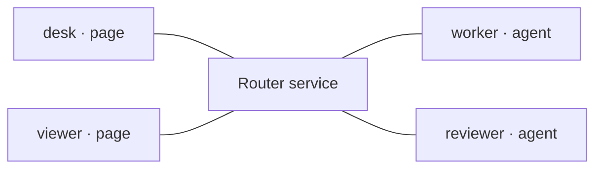

<section class="lesson">

## Every client connects to the router, not its peer

After [Configure](./configure.html), authenticate each participant separately. These lines show WebSocket connections, not grants. An authenticated connection proves neither permission to every destination nor application readiness.

<protocol-diagram aria-label="Transport connections: desk, viewer, worker and reviewer each connect to the central Router service; no direct peer connections.">



</protocol-diagram>

</section>

<section class="lesson">

## The credential shape is the same; the provisioning path differs

**Authentication:** the private token proves which configured participant is connecting. **Authorization:** the router's private `allow` list decides which destinations that identity may initiate toward. A token is not a grant list; neither adding an `allow` field to a client nor knowing a destination gives permission.

`setup` generates the participant tokens in the private router config. `serve` reads that config and writes each participant's private endpoint record only after the listener starts. Each record supplies the same base fields below; agent-kind connections additionally need a `sessionId`.

<div class="credential-shapes">

<div>

### Page: desk

```
{
  wsUrl: "ws://127.0.0.1:8787/ws",
  participant: "desk",
  token: "<desk's private token>"
  // No sessionId for a page.
}
```

</div>

<div>

### Agent: worker

```
{
  wsUrl: "ws://127.0.0.1:8787/ws",
  participant: "worker",
  token: "<worker's private token>",
  sessionId: "worker-example"
}
```

</div>

</div>

The browser literal below and the Node `JSON.parse` + spread below are two ways to construct these same connection fields, not two credential formats. Node can read its authorized private file directly. An ordinary browser page cannot read that filesystem path, and this client does not automatically fetch an endpoint record.

### How does the browser receive its token?

**This is an explicit application-provisioning prerequisite, not implemented by this reference.** The page owner must choose an authorized, private way to supply only that page's endpoint values into its runtime memory. “Out of band” means that this happens outside router message delivery and outside this static site. Do not replace the placeholder by committing a token into JS/HTML, publishing an endpoint file, or adding a public token-fetch URL. Until private provisioning is established, the browser example is illustrative and not ready to connect.

</section>

<section class="lesson">

## Browser page: desk (or viewer in its own page)

In your own authorized frontend, import the shipped client module and its relative dependencies. The router serves them at `/assets/`; this static reference deliberately does not. A same-origin frontend can be served using the router's `--public-root` option with a public-safe directory. Never serve the repository or private setup directory.

```
import {createMessageRouterClient} from "/assets/client.js";

// Memory-only value provisioned out of band by the page's owner.
// Replace placeholders privately, NOT in a public JS/HTML file.
const deskCredentials = {
  wsUrl: "ws://127.0.0.1:8787/ws",
  participant: "desk",
  token: "<privately supplied desk token>"
};
const desk = createMessageRouterClient({
  onMessage: message => console.log(message.from, message.payload),
  onResponse: response => console.log(response)
});
console.log(await desk.connect(deskCredentials));
// viewer uses its own credential and a separate client in its own context.
```

<div class="result">

### Expected connect result

```
{"v": 2, "type": "hello_ack", "participant": "desk", "kind": "page"}
```

For viewer, use a separate page/context and replace `desk` with `viewer` in the client variable, credential variable, participant ID and private token. The viewer handler logs the one-way payload and sends no reply.

The browser Origin must match the router by default. For a separately hosted frontend, explicitly authorize its exact origin with `--origin http://127.0.0.1:3000` and copy/bundle the browser modules into that frontend. This guide's own CSP and permissions remain unchanged; it never connects.

</div>

</section>

<section class="lesson">

## Node: a generic agent-kind client, not a Pi agent

Use a Node runtime with built-in WebSocket (for example Node 22+) and run from the checkout root. Save this as a private `.mjs` file in that root or adjust the import path. Set `WORKER_ENDPOINT` to the private worker endpoint file emitted by your owned router.

```
import {readFile} from "node:fs/promises";
import {createMessageRouterClient} from "./.agents/tools/message-router/browser/client.js";

const workerCredentials = {
  ...JSON.parse(await readFile(process.env.WORKER_ENDPOINT, "utf8")),
  sessionId: "worker-example"
};
const worker = createMessageRouterClient({
  onMessage: async message => {
    console.log(message.from, message.payload);
    if (message.expectReply) {
      console.log(await worker.respond(message.id, {answer: "Outline checked"}));
    }
  },
  onResponse: response => console.log(response)
});
console.log(await worker.connect(workerCredentials));
// Keep this process running to receive messages; worker.close() when finished.
// reviewer is a SEPARATE client/process: use its own endpoint + reviewer-example.
```

<div class="result">

Expected: `{"v":2,"type":"hello_ack","participant":"worker","kind":"agent"}`. Agent-kind authentication requires a `sessionId`. Page-kind authentication must not include one. A second connection cannot displace an already-connected identity.

</div>

Run the private file with `WORKER_ENDPOINT=/your/private/endpoints/participants/worker.json node worker-example.mjs`. For reviewer, make a separate copy: rename the `worker`/`workerCredentials` variables to `reviewer`/`reviewerCredentials`, use `REVIEWER_ENDPOINT` pointing at `reviewer.json`, and change the session ID to `reviewer-example`. Keep both processes connected for the independent initiation lesson.

**This generic JavaScript handler does not launch Pi, a model turn, or another agent.** It simply receives JSON and emits JSON. The Send page's worker/reviewer examples use these generic clients.

</section>

<section class="lesson">

## Native Pi adapter: an alternative owner of the agent identity

If using Pi instead, install/configure its shipped message-router extension through the approved setup process. In an existing authorized Pi session, open that agent's private endpoint:

```
// message_router tool arguments inside the intended Pi session
{"action":"open", "endpoint":"/private/example/endpoints/participants/worker.json"}
```

`open` binds the current Pi session; it starts neither router nor agent. Do not simultaneously connect the Node worker with the same identity. Pi admission and delivery options are separate from router forwarding. A tool reply uses `action: "send"` and the exact pending inbound ID as `replyTo`; outbound tool requests use `action: "route"`. The current adapter ignores one-way notifications.

</section>

<a class="next" href="./discover.html">Next: inspect permitted destinations →</a>
