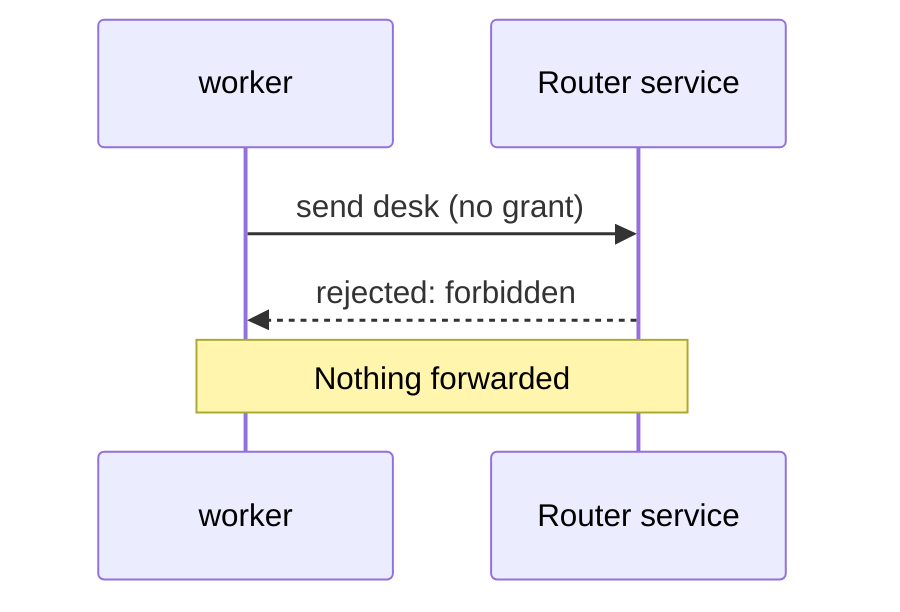
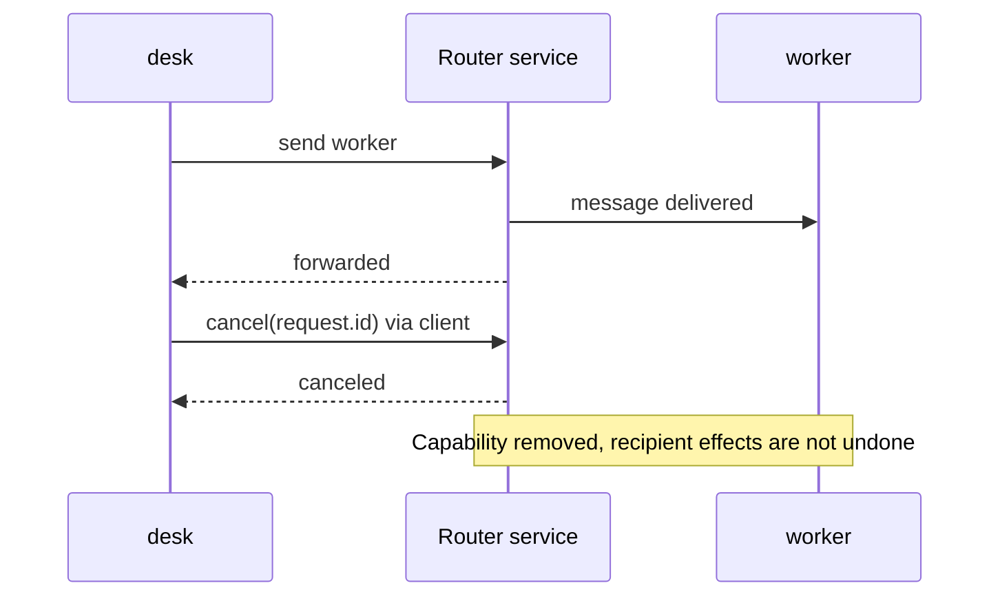

<section class="lesson">

## Forbidden: no grant in this direction

worker may reply to a desk request, but cannot start a new worker → desk message under this configuration.

<protocol-diagram aria-label="worker tries to initiate to desk; router rejects forbidden before forwarding.">



</protocol-diagram>

```
try {
  await worker.send("desk", {question: "New request"}).accepted;
} catch (error) {
  console.log(error.message); // "forbidden"
}
```

<div class="result">

The client rejects `accepted` with an Error. The underlying wire result is `{"v":2,"type":"result","requestId":"<ID>","status":"rejected","error":"forbidden"}`. No forwarding occurs. A return capability does not change the grant.

</div>

</section>

<section class="lesson">

## Offline: allowed, but no current recipient connection

Close the separately owned viewer client first. desk → viewer is still permitted, but not currently deliverable.

```
// In viewer's context:
viewer.close();
// After the router has observed that disconnect, in desk's context:
try {
  await desk.send("viewer", {notice: "Outline changed"}, {expectReply:false}).accepted;
} catch (error) {
  console.log(error.message); // "offline"
}
```

<div class="result">

Expected rejection: `error.message === "offline"`. No durable queue retains the message. This assumes disconnect has reached the router; an in-flight emission race can instead be uncertain. status is only a point-in-time observation.

</div>

</section>

<section class="lesson">

## Cancel correlation, not recipient actions

For this example, temporarily use a worker handler that logs but does not respond. Cancel only after the request has an acknowledged route ID and while it is still pending.

<protocol-diagram aria-label="After forwarding, desk cancels via its request ID; router removes the reply capability but does not retract the worker's work.">



</protocol-diagram>

```
const request = desk.send("worker", {question: "Check this outline?"});
const accepted = await request.accepted;
if (accepted.status === "forwarded") {
  console.log(await desk.cancel(request.id));
}
```

<div class="result">

Expected while still pending: `{"v":2,"type":"result","requestId":"<cancel RPC ID>","status":"canceled"}`. The argument is the original sender's `request.id`; the result has a new cancellation RPC ID.

Cancel sends no retraction or cancellation event to the recipient. A late recipient response is rejected `unknown_route`. If a final reply wins the race, cancel may instead fail locally with `No acknowledged pending route` or be rejected `unknown_route`; do not claim cancellation succeeded without its result.

</div>

</section>

<section class="lesson">

## Disconnect or uncertain transport: do not auto-resend

```
// Register when creating desk (or pass as a send onResponse option):
onResponse: response => {
  if (response.type === "route_closed") {
    console.log(response.uncertain, response.reason);
    // Report uncertainty. Do not automatically retry the application action.
  }
}
// When finished with your own client:
desk.close();
```

<div class="result">

A remote peer disconnect can emit `{"v":2,"type":"route_closed","id":"<route ID>","requestId":"<sender request ID>","reason":"peer_disconnected","uncertain":true}` to the sender. Local `close()` also invalidates work; its client-generated callbacks have no wire `v` field and use reason `Closed explicitly; delivery uncertain`.

A forwarding result may itself have `status: "uncertain"` rather than rejecting. Check it; a resolved promise is not necessarily `forwarded`. Disconnect, timeout, or a failed write cannot prove the recipient did nothing.

</div>

Reconnect explicitly with the same authorized identity when appropriate; old reply capabilities cannot be recovered. Bounded duplicate detection is not exactly-once execution. The router has no automatic reply expiry: final response, explicit cancel, or either endpoint's disconnect releases correlation.

</section>

<a class="next" href="./configure.html">Return to the configuration and permissions →</a>
