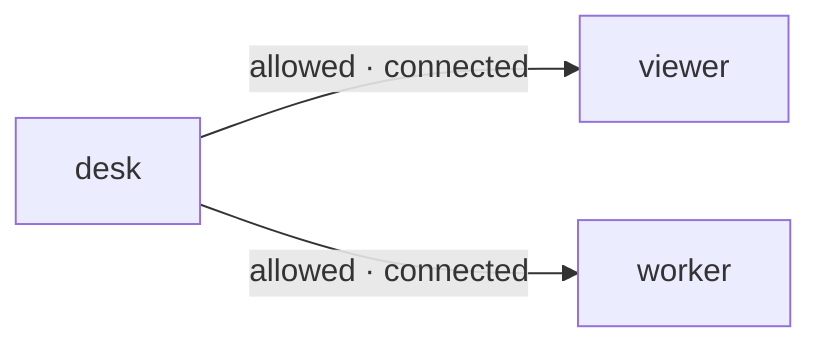

# Discover

## Ask what *this client* may address

`desk.status()` returns desk's configured destinations and their current connection presence. It is not a global participant directory or a reverse-permission query.

Allowed-destination view for desk only: viewer and worker. These arrows are grants, not physical transport. Presence here assumes both are connected.



```javascript
// After the Connect page's desk.connect(...) has completed:
const status = await desk.status();
console.log(status);
```

### Expected result with viewer and worker connected, no pending routes

```json
{
  "v": 2,
  "type": "result",
  "requestId": "<generated status request ID>",
  "status": "connected",
  "participant": "desk",
  "destinations": [
    {"id": "viewer", "kind": "page", "connected": true},
    {"id": "worker", "kind": "agent", "connected": true}
  ],
  "pending": 0
}
```

Destinations are sorted by ID. reviewer is absent because desk has no grant to reviewer—even if reviewer is online. An allowed destination stays listed with `connected: false` when offline.

## Presence is a snapshot, not a delivery guarantee

- `connected` describes a current authenticated router connection, not handler readiness, Pi availability, or model activity. The peer may disconnect before your next send.
- `pending` counts active reply capabilities involving this connection as sender *or* recipient—not queued messages, unread messages, or durable work.
- No tokens, global topology, other participants' grant lists, or history are returned.

Call status when it informs a decision. There is no automatic reconnect, replay, durable queue, or implicit destination. Always choose the intended `to` explicitly.

[Next: independent messages, replies and one-way notifications →](./send.md)
