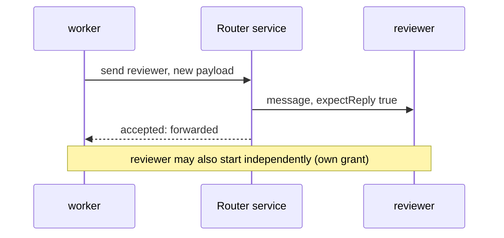
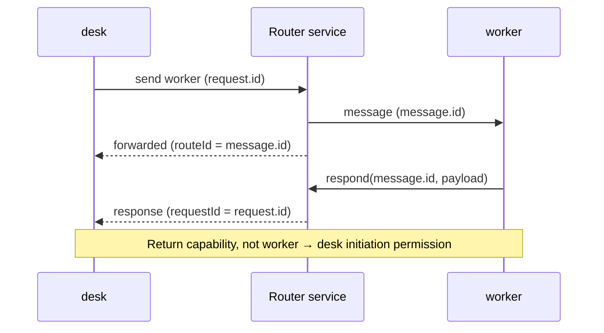
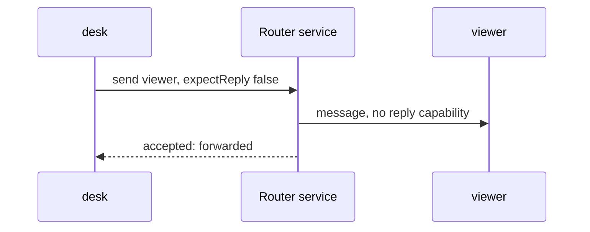

# Send

First [configure the grants](./configure.md) and [connect the clients](./connect.md). These snippets use the connected clients from that setup, in their separate participant contexts. No example runs in this guide.

## A new message needs no earlier request

**worker → reviewer** is an explicit grant. Either agent can start independently because the reverse grant is also configured. A connection alone would not permit this.

New-message transport: worker to router service to reviewer; the service returns a forwarding receipt.



```javascript
// worker context — default expectReply is true
const request = worker.send("reviewer", {question: "Check this outline?"});
console.log(await request.accepted);

// reviewer context — an independent start, not a reply to request
const separate = reviewer.send("worker", {question: "Which section next?"});
console.log(await separate.accepted);
```

### Expected transport result

```json
{
  "v": 2, "type": "result", "requestId": "<sender-generated request ID>",
  "status": "forwarded", "routeId": "<router-generated route ID>"
}
```

`forwarded` means the router emitted the message to the current recipient connection. It does not establish handling, Pi admission, or a model answer. A reply-enabled request remains pending until final response, cancel, or disconnect.

## Reply to the received message—not to a participant name

**desk → worker** allows the request. worker can respond through its connection-bound return capability even though **worker → desk** is not a grant.

Request passes through the router to worker; the optional response returns through the router using the received message ID.



```javascript
// Register this handler when creating worker, BEFORE connecting it:
const worker = createMessageRouterClient({
  onMessage: async message => {
    console.log(message.from, message.payload);
    if (message.expectReply) {
      await worker.respond(message.id, {answer: "Outline checked"});
    }
  }
});
await worker.connect(workerCredentials); // private setup from Connect

// In the separately connected desk context:
const request = desk.send("worker", {question: "Check this outline?"}, {
  expectReply: true, // default; explicit here for clarity
  onResponse: response => console.log(response)
});
console.log(request.id);            // sender's correlation ID
console.log(await request.accepted); // transport receipt only
```

### Expected response callback at desk

```json
{
  "v": 2, "type": "response", "id": "<message.id / routeId>",
  "requestId": "<request.id>",
  "from": {"id": "worker", "kind": "agent", "sessionId": "worker-example"},
  "payload": {"answer": "Outline checked"}, "metadata": {}, "final": true
}
```

`message.id` (recipient) is the router's route ID; `request.id` (sender) is a different ID. Responses can arrive *before* `request.accepted` resolves, so register the handler first. `respond` defaults to `final: true`, releasing the capability; `final: false` emits an intermediate response.

The diagram shows one possible order, not an ordering guarantee. To initiate a separate worker → desk message, configure a separate grant; a reply never creates it.

## No reply requested, no return capability

Send **desk → viewer** with `expectReply: false` when the receiving page needs only a notification.

One-way notification from desk through router service to viewer. There is no response path.



```javascript
// viewer's onMessage handler may display message.payload; do not respond.
const notification = desk.send("viewer", {notice: "Outline changed"}, {
  expectReply: false
});
console.log(await notification.accepted); // status: "forwarded", not "handled"
```

### Expected recipient event

```json
{
  "v": 2, "type": "message", "id": "<route ID>",
  "from": {"id": "desk", "kind": "page"}, "to": "viewer",
  "payload": {"notice": "Outline changed"}, "metadata": {}, "expectReply": false
}
```

No reply capability is allocated. **The current Pi adapter ignores one-way notifications.** Use reply-enabled requests for Pi agents; a router forwarding receipt alone still does not prove Pi admission.

[Next: distinguish failures and uncertainty →](./failures.md)
