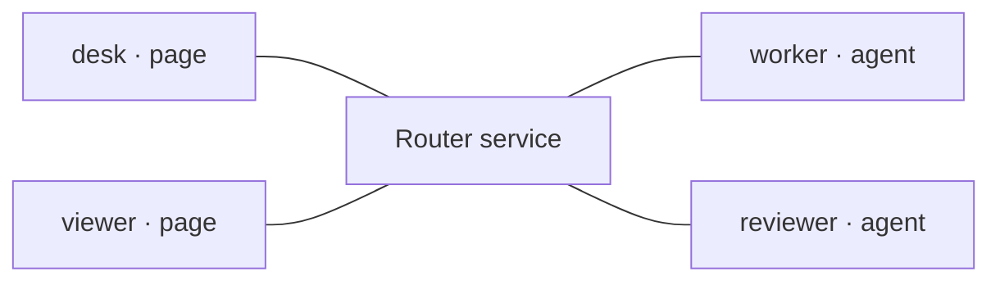
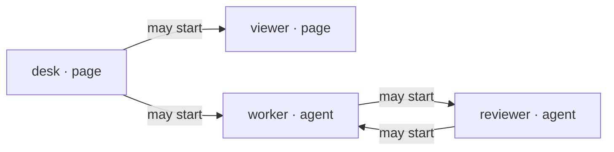

# Automata Message Router

Connect the intended participants, verify targeted delivery, and recover or close
connections without confusing transport state with application outcomes.

## Runtime dispatch

The mapped shell CLI and generic browser client are shared. The agent-session
`message_router` tool, Pi browser client, and admission/`nextTurn` semantics require
Pi's adapter; installing the shared CLI or this skill does not expose them in
native Codex CLI. Identify the host and actual tools, not its model/provider name.

In Codex, authorized service setup and browser-to-browser use can use the shared
CLI/client. For routing into the current Codex agent, report the missing adapter;
do not substitute history injection, hooks, a daemon connection or an invented
tool call. The reference's Pi tool examples and the Exchange section below apply
only where that Pi adapter is available. Transport receipts never prove model
admission or a new agent turn in another host.

## One service, explicitly addressed participants

The Message Router carries bounded JSON between browser pages and agent sessions.
Each participant connects to one central service with its own private credential.
A sender names a destination; the service checks permission and forwards the
message to that connected participant.

It is transport—not an agent launcher, a task manager, a shared transcript, or
proof that a recipient acted. Components and agents own the meaning of the payload
and the authority to act on it.

Physical connections: desk and viewer pages, worker and reviewer agents each
connect to one central Router service. The service is not a participant.



## A connection is not a grant

Being online makes a participant reachable; it does not let that participant
initiate toward everyone else. A directed grant says who may **start** a message
toward whom. Here desk may start toward viewer or worker; worker and reviewer may
each start toward the other.

Initiation grants only, not physical connections: desk may start toward viewer
and worker; worker and reviewer may start toward each other.



A reply uses a capability tied to an existing request and its connections. It does
not require a reverse initiation grant and does not create one.

## Start a message; choose whether a reply is needed

- **Initiation:** an allowed sender starts a new message to an explicit destination.
- **Optional reply:** a reply-capable request lets its recipient respond or reject
  using the exact delivered message ID. This is a return path, not a new independent
  initiation.
- **One-way:** `expectReply: false` creates no reply capability. The generic browser
  client supports this; the native Pi adapter ignores one-way messages rather than
  creating a model turn.

**Forwarded ≠ handled.** Acceptance confirms forwarding, not application success.
Correlate the terminal reply when one is requested; an uncertain send must not be
blindly replayed.

## Reference

1. [Configure](references/configure.md) private credentials and directed grants.
1. [Connect](references/connect.md) the intended browser or agent clients.
1. [Discover](references/discover.md) caller-visible, allowed destinations.
1. [Send](references/send.md) independent requests, replies, and one-way messages.
1. [Handle failures](references/failures.md) without confusing rejection,
   cancellation, and uncertain effects.

These Markdown files are the canonical reference; agent use requires no browser,
build tools, or live router. The optional Skill Builder website renders these same
files for people. Its diagrams and examples use a fixed illustrative topology;
it is not a dashboard or simulator and never connects to a router.

## Connect or reuse

Consult relevant saved setup knowledge before reconstructing commands. Reuse a
connection only after checking its status, intended endpoints and ownership—not
merely a listening port or old record.
Use the mapped tool's `--help` for commands and its browser API documentation for
integration; reuse the shipped client and server rather than regenerating them.

```bash
uv run --offline --no-project --script .agents/tools/message-router/message_router.py --help
```

`setup` provisions private participant credentials and directed grants; `serve`
starts the listener. Neither launches an agent. In Pi, `message_router` opens the
intended agent credential with the current session. Use explicit participant IDs
and destinations, not page directories or whichever agent happens to be online.
Static hosting is optional and independent of Adaptive UI; serve only public-safe
files. Establish missing installation within existing authority.

Use loopback unless broader access is authorized. Keep participant credentials and
endpoint records out of public assets and logs; retain live identity only for
reconnection and owned cleanup, revalidating after session changes.

After setup discovery succeeds, save verified startup, connection, status-check,
and owned cleanup commands with prerequisites, working directories and variable inputs
in approved owner-scoped data, separate from live endpoint records. Report the recipe's
location; exclude live session identifiers and do not duplicate tool documentation. Do not retain pairing secrets as setup knowledge
or treat saved setup as permission.

## Exchange (Pi agent adapter)

Carry complete bounded JSON without projecting it onto component-specific fields.
Components own payload and reply semantics; routing is independent of UI choice.
Use `action=route` with an explicit authorized `to` for a new request. Its receipt
is not a peer answer; `receive` with the returned id as `replyTo` consumes a terminal
reply without triggering another model turn. Do not busy-poll or treat permission
to connect as permission to delegate work.

For an inbound request, use its exact message ID as `replyTo` and the component's
complete reply as `payload` with `action=send`. Keep the binding open while the
interaction continues. Consult the tool's compatibility notes for existing Chat
and version-one integrations; do not silently change their delivery semantics.

Use canonical message/tool-call records rather than adding duplicate transcripts.
Page or agent provenance does not grant authority for shell, file, or external actions.

For context without a new request, use the client's context delivery options:
`nextTurn` queues data for the next prompt; a named slot replaces its pending value.
Use `inspect_context` or `clear_context` to manage pending data, not history.
Consult tool documentation for `steer`, `followUp`, and trigger behavior. Distinguish
buffered, queued, and attached receipts; none proves the model acted on the data.

## Verify and recover

Verify a correlated exchange along the intended route. Distinguish connection,
server receipt, agent admission (Pi adapter only), reply delivery, and component handling; a transport
receipt or terminal-only answer is not an end-to-end result.

Check busy/disconnect behavior when relevant. Do not silently replay an uncertain
send. Revalidate affected endpoints and routing when earlier evidence is no longer
current; repair only the affected setup and update the recipe after verification.
In-memory correlation does not promise durable history or exactly-once business execution.

## Close

When the interaction ends, close its binding and stop only owned router services
that are no longer needed. Preserve pages and evidence; stopping a connection does
not authorize deleting them.

## Boundaries

This skill owns connection, delivery verification, and recovery judgment. UI
construction, component contracts, browser control, delegation, and installation
belong to their respective capabilities. Command options and protocol mechanics
belong to the tool; task-specific policy stays with the task.
