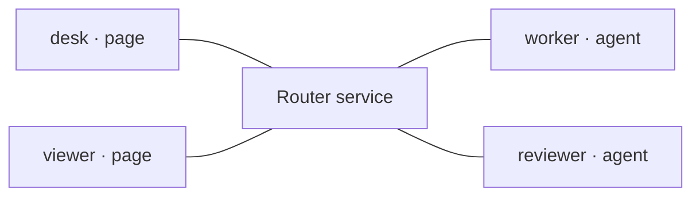
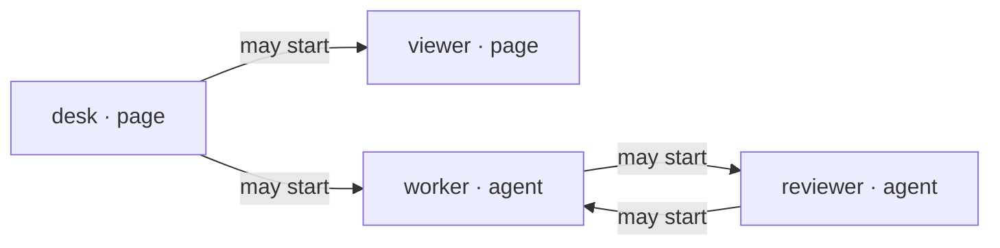

# Automata Message Router

Use or connect the intended participants, verify targeted delivery and meaningful
handling, and recover or close connections without confusing transport state with
application outcomes.

## Choose an available connection

Reuse the shared service and shipped browser/Node client, or an actually exposed
agent adapter. Consult the mapped tool's documentation for client recipes and the
adapter's own contract for session admission and delivery controls. Installing
this skill or the shell CLI does not register an agent tool or provide model wakeup.

An active agent can read and answer through an owned shell process with authorized
loopback access, private credentials and a live connection. Do not invent a tool,
inject history, attach to an unrelated daemon or add a polling service as a
fallback. Transport receipts never prove model handling or a new agent turn.
Collaboration ownership and process management remain separate from this transport.

## One service, explicitly addressed participants

The Message Router carries bounded JSON between browser pages and agent sessions.
Each participant connects to one central service with its own private identity.
Direct clients use private tokens; an opt-in same-origin browser session can pair
once and reconnect without exposing the permanent page token.
A sender names a destination; the service checks permission and forwards the
message to that connected participant.

It is transport—not an agent launcher, a task manager, a shared transcript, or
proof that a recipient acted. Components and agents own the meaning of the payload
and the authority to act on it.

Physical connections: desk and viewer pages, worker and reviewer agents each
connect to one central Router service. The service is not a participant.



## A connection is not a grant

Being online makes a participant reachable; it does not let that participant
initiate toward everyone else. A directed grant says who may **start** a message
toward whom. Here desk may start toward viewer or worker; worker and reviewer may
each start toward the other.

Initiation grants only, not physical connections: desk may start toward viewer
and worker; worker and reviewer may start toward each other.



A reply uses a capability tied to an existing request and its connections. It does
not require a reverse initiation grant and does not create one.

## Start a message; choose whether a reply is needed

- **Initiation:** an allowed sender starts a new message to an explicit destination.
- **Optional reply:** a reply-capable request lets its recipient respond or reject
  using the exact delivered message ID. This is a return path, not a new independent
  initiation.
- **One-way:** `expectReply: false` creates no reply capability. The generic client
  supports this; verify whether the recipient's adapter accepts it. Some adapters
  ignore one-way messages rather than creating a model turn.

**Forwarded ≠ handled.** Acceptance confirms forwarding, not application success.
Correlate the terminal reply when one is requested; an uncertain send must not be
blindly replayed.

## Reference

1. [Configure](references/configure.md) private credentials and directed grants.
1. [Connect](references/connect.md) the intended browser or agent clients.
1. [Discover](references/discover.md) caller-visible, allowed destinations.
1. [Send](references/send.md) independent requests, replies, and one-way messages.
1. [Handle failures](references/failures.md) without confusing rejection,
   cancellation, and uncertain effects.

These Markdown files are the canonical reference; agent use requires no browser,
build tools, or live router. The optional Skill Builder website renders these same
files for people. Its diagrams and examples use a fixed illustrative topology;
it is not a dashboard or simulator and never connects to a router.

## Connect or reuse

Consult relevant saved setup knowledge before reconstructing commands. Reuse a
connection only after checking its status, intended endpoints and ownership—not
merely a listening port or old record.
Use the mapped tool's `--help` for commands and its browser API documentation for
integration; reuse the shipped client and server rather than regenerating them.

```bash
uv run --offline --no-project --script .agents/tools/message-router/message_router.py --help
```

`setup` provisions private participant credentials and directed grants; `serve`
starts the listener. Neither launches an agent. Open the intended agent credential
with an available client bound to the actual session. Use explicit participant IDs
and destinations, not page directories or whichever agent happens to be online.
Static hosting is optional and independent of Adaptive UI; serve only public-safe
files. Establish missing installation within existing authority.

For the tool's opt-in local browser pairing, keep auth state/control outside public
roots and provision fresh single-use codes privately. A persistent revocable
cookie authenticates only its fixed page identity; it changes neither grants nor
reply/session binding. Pairing, Connect, Disconnect and Forget are distinct.
Check cookie status and reconnect explicitly after shutdown; restarting the
service and binding the intended actual agent session remain explicit actions,
not startup automation. A second tab cannot displace the active identity. Do not
fall back to exposed tokens, cache codes, replay saved sends or revive lost reply
capabilities. Authentication, destination presence, admission and component
handling are separate evidence. Follow the tool's local-session documentation for
exact Origin/Host boundaries, private operator commands and revocation.
Local HTTP cookies are not Secure or port-isolated; HttpOnly is not a same-origin
script/action sandbox or protection from malicious same-user processes.

Use loopback unless broader access is authorized. Keep participant credentials and
endpoint records out of public assets and logs; retain live identity only for
reconnection and owned cleanup, revalidating after session changes.

After setup discovery succeeds, save verified startup, connection, status-check,
and owned cleanup commands with prerequisites, working directories and variable inputs
in approved owner-scoped data, separate from live endpoint records. Report the recipe's
location; exclude live session identifiers and do not duplicate tool documentation. Do not retain pairing secrets as setup knowledge
or treat saved setup as permission.

## Exchange

Carry complete bounded JSON without projecting it onto component-specific fields.
Components own payload and reply semantics; routing is independent of UI choice.
Use an explicit authorized destination for a new request. Register correlation
before sending and consume the terminal response through the same client; a
forwarding receipt is not the peer's answer. Do not busy-poll or treat permission
to connect as permission to delegate work.

With the shipped browser/Node client, register inbound handling in `onMessage`
and reply handling in `onResponse` (or the per-send option) before sending. Handle
both responses and route closure; validate and apply the component-owned reply
or show its failure, rather than merely logging it. Per the mapped tool's client
contract, distinguish adapter admission/context receipts in `metadata.pi` from
component payload replies before component validation. Retain correlation and
pending state until `final: true`, `route_closed` or explicit cancellation as
documented in [Send](references/send.md) and [Handle failures](references/failures.md);
nonterminal component progress may be applied when its own contract allows.
Components on one page may share a page-owned client: correlate each request with
its originating instance, keep pending states independent, and prevent late replies
updating replacements.
Page-to-page messages likewise need a recipient handler that applies the payload;
transport does not provide shared application state or impose a payload schema.

For an inbound reply-capable request, use the exact delivered message ID and the
component's complete reply; use the documented client's `respond` or the exposed
adapter's reply operation. Report the handling actually performed, not success
merely from receipt. Keep the connection open while interaction continues; reply
capabilities are connection-bound. Do not manufacture IDs, reply to one-way
messages or silently alter legacy delivery semantics.

Use canonical message/tool-call records rather than adding duplicate transcripts.
Page or agent provenance does not grant authority for shell, file or external actions.

If the adapter offers context delivery without a new request, follow its actual
queue, steering and turn-trigger contract. Manage pending data separately from
conversation history. Distinguish buffered, queued, attached and handled receipts;
none of the first three proves the model acted on the data.

## Verify and recover

Verify a correlated exchange along the intended route. Distinguish connection,
server receipt, agent admission where supported, reply delivery and component
handling. For a UI exchange, verify the originating component visibly applies
the valid reply and represents failure/uncertainty; a transport receipt or
terminal-only answer is not an end-to-end result.

Check busy/disconnect behavior when relevant. Do not silently replay an uncertain
send. Revalidate affected endpoints and routing when earlier evidence is no longer
current; repair only the affected setup and update the recipe after verification.
In-memory correlation does not promise durable history or exactly-once business execution.

## Close

When the interaction ends, close its binding and stop only owned router services
that are no longer needed. Preserve pages and evidence; stopping a connection does
not authorize deleting them.

## Boundaries

This skill owns connection, delivery verification, and recovery judgment. UI
construction, component contracts, browser control, delegation, and installation
belong to their respective capabilities. Command options and protocol mechanics
belong to the tool; task-specific policy stays with the task.
