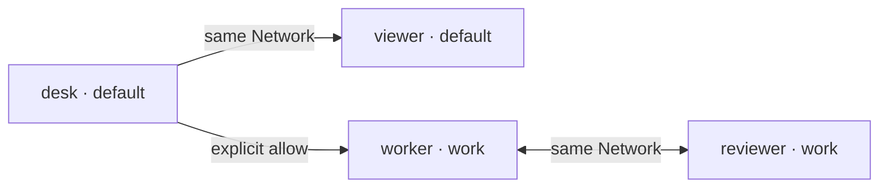

# Configure

## Example central policy

For the [core identity and policy contract](../SKILL.md), provision desk/viewer in
`default` and worker/reviewer in `work`. Same-Network peers need no explicit grants.
Allow desk → worker across Networks; block viewer → desk despite their shared
Network. These arrows illustrate effective initiation permission, not connections:



## Prepare a private example router

Run from a checkout with documented Python dependencies already available. These
are manual instructions, not actions taken by the guide. Choose a new private
location outside every public root. Setup refuses to overwrite existing config.

```bash
umask 077
PRIVATE="$(mktemp -d "${TMPDIR:-/tmp}/anatomy-router.XXXXXXXX")"
uv run --offline --no-project --script .agents/tools/message-router/message_router.py setup \
  --config-file "$PRIVATE/router.json" \
  --page desk --page viewer --node worker --node reviewer \
  --network worker:work --network reviewer:work \
  --allow desk:worker --block viewer:desk

uv run --offline --no-project --script .agents/tools/message-router/message_router.py serve \
  --config-file "$PRIVATE/router.json" --endpoint-dir "$PRIVATE/endpoints" --port 8787
```

Without identity options, setup creates one generic `node` in `default`. Repeat
`--node` for generic endpoints. `--page` selects the optional browser-session
adapter; `--agent` selects the session-ID-required adapter. Kind never grants
routing access. No pairing ceremony is required on the configured-node path.

Setup creates private configuration and distinct random tokens, not processes or
clients. Serve binds loopback and only then writes mode-0600 endpoint records.
Missing offline dependencies are a separate prerequisite, not permission to download.

Configuration shape (placeholders, not working credentials):

```json
{
  "v": 2,
  "nodes": {
    "desk": {"kind": "page", "token": "<private desk token>"},
    "viewer": {"kind": "page", "token": "<private viewer token>"},
    "worker": {"token": "<private worker token>", "network": "work"},
    "reviewer": {"token": "<private reviewer token>", "network": "work"}
  },
  "allow": ["desk:worker"],
  "block": ["viewer:desk"]
}
```

`kind` defaults to `node`; `network` defaults to `default`. Networks are inferred
from assignments, not separately registered. `allow`/`block` are optional lists of
exact directed `source:destination` node pairs, not network names or wildcards.
Blocks always win. The caller is excluded from implicit same-Network peer access;
explicit self-allow is possible. Actual tokens must be distinct 32–256-character
ASCII strings. Node IDs and Network names use 1–128 ASCII letters, digits, `_` or
`-`. At most 128 nodes are supported.

## Preserve old explicit permission meaning

Version-1 `{v:1,participants:{id:{kind,token,allow:[ids]}}}` configs remain supported
with only their original explicit grants. They do not gain Network defaults or
require credential rotation. To opt into v2, deliberately move entries to `nodes`,
retain credentials/kinds, assign Networks and review the resulting defaults and
central rules. To preserve an explicit-only topology, give each node a separate
Network and translate old grants into central `allow` pairs. Merely changing `v`,
or retaining per-node `allow` inside v2 entries, is rejected.

## Keep identity material private

`server.json` contains listener metadata without tokens. Each private
`endpoints/participants/<id>.json` contains that node's credential, URL and Network.
The historical path and wire `participant` field remain for actual consumers; they
do not restrict endpoint types. Provision only the intended node's record out of
band. Never publish the config/endpoints, commit tokens or substitute another
identity's credential.

For optional `page` pairing, provision `serve --auth-dir <private-directory>`
outside public roots; [Connect](./connect.md) owns that adapter's controls and
limitations. Generic-node configuration does not require pairing.

Changing admission, membership or rules is an owner operation: review private
config and restart the owned router. A client cannot change its own permissions.
The Router service itself is not an authenticated Node.

[Next: connect the clients →](./connect.md)
