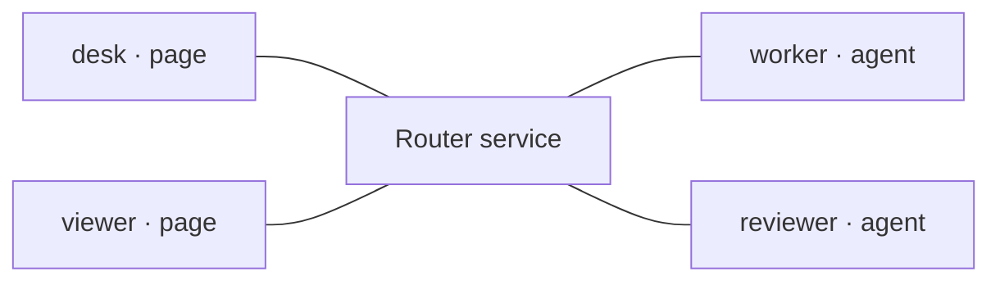

# Connect

## Every client connects to the router, not its peer

After [Configure](./configure.md), authenticate each participant separately. These lines show WebSocket connections, not grants. An authenticated connection proves neither permission to every destination nor application readiness.

Transport connections: desk, viewer, worker and reviewer each connect to the central Router service; no direct peer connections.



## Optional same-origin browser session

The Router's opt-in `serve --auth-dir <private-directory>` supports local persistent
page pairing inside the same process. Its private `pair --auth-dir ...
--participant desk` command issues a single-use code to deliver out of band.
The browser submits only that code; the server binds the configured page identity.
No permanent token is exposed and no grant list is supplied by the browser.

```javascript
import {createBrowserSessionAuth} from "/assets/session.js";
import {createMessageRouterClient} from "/assets/client.js";
const auth = createBrowserSessionAuth();
const desk = createMessageRouterClient({onMessage, onResponse});
// Wire these to explicit user controls, not automatic startup:
await auth.pair(privatelySuppliedCode);
const status = await auth.status(); // inert; valid cookie may survive restart
await desk.connectSession(auth.connection(status));
desk.close(); // keep pairing
await auth.forget(); // revoke cookie session, close active socket and clear cookie
```

This uses `/session/ws` with token-free `{v:2,type:'hello'}` and the same routing
client; it has no fallback to a token. It requires the exact authoritative local
HTTP 127.0.0.1 origin and mandatory same-origin cookie WebSocket Origin. Additional
`--origin` settings below apply only to the direct-token path. Cookies are
HttpOnly/SameSite=Strict, not Secure on HTTP or isolated by port; same-origin scripts
and malicious same-user processes remain outside this boundary.

Reconnect is explicit. Restart the owned service and bind the intended actual
agent session explicitly; pairing never launches an agent. Old sends, events and
reply capabilities do not recover or replay. Preserve the draft origin/profile.
See the mapped tool's `docs/local-session.md` for lifetimes, private storage,
operator revocation and limitations. Direct-token/Node integrations below remain
supported independently; do not use them as a public-token fallback.

## The direct credential shape is the same; the provisioning path differs

**Authentication:** the private token proves which configured participant is connecting. **Authorization:** the router's private `allow` list decides which destinations that identity may initiate toward. A token is not a grant list; neither adding an `allow` field to a client nor knowing a destination gives permission.

`setup` generates the participant tokens in the private router config. `serve` reads that config and writes each participant's private endpoint record only after the listener starts. Each record supplies the same base fields below; agent-kind connections additionally need a `sessionId`.

### Page: desk

```javascript
{
  wsUrl: "ws://127.0.0.1:8787/ws",
  participant: "desk",
  token: "<desk's private token>"
  // No sessionId for a page.
}
```

### Agent: worker

```javascript
{
  wsUrl: "ws://127.0.0.1:8787/ws",
  participant: "worker",
  token: "<worker's private token>",
  sessionId: "worker-example"
}
```

The browser literal below and the Node `JSON.parse` + spread below are two ways to construct these same connection fields, not two credential formats. Node can read its authorized private file directly. An ordinary browser page cannot read that filesystem path, and this client does not automatically fetch an endpoint record.

### How does a direct-token browser receive its token?

**This is an explicit application-provisioning prerequisite for the direct path.**
Prefer the opt-in session flow above when permanent browser tokens should remain
server-side; do not mix the two authentication modes or silently fall back.

The page owner must choose an authorized, private way to supply only that page's endpoint values into its runtime memory. “Out of band” means that this happens outside router message delivery and outside this static site. Do not replace the placeholder by committing a token into JS/HTML, publishing an endpoint file, or adding a public token-fetch URL. Until private provisioning is established, the browser example is illustrative and not ready to connect.

## Browser page: desk (or viewer in its own page)

In your own authorized frontend, import the shipped client module and its relative dependencies. The router serves them at `/assets/`; this static reference deliberately does not. A same-origin frontend can be served using the router's `--public-root` option with a public-safe directory. Never serve the repository or private setup directory.

```javascript
import {createMessageRouterClient} from "/assets/client.js";

// Memory-only value provisioned out of band by the page's owner.
// Replace placeholders privately, NOT in a public JS/HTML file.
const deskCredentials = {
  wsUrl: "ws://127.0.0.1:8787/ws",
  participant: "desk",
  token: "<privately supplied desk token>"
};
const desk = createMessageRouterClient({
  onMessage: message => console.log(message.from, message.payload),
  onResponse: response => console.log(response)
});
console.log(await desk.connect(deskCredentials));
// viewer uses its own credential and a separate client in its own context.
```

### Expected connect result

```json
{"v": 2, "type": "hello_ack", "participant": "desk", "kind": "page"}
```

For viewer, use a separate page/context and replace `desk` with `viewer` in the client variable, credential variable, participant ID and private token. The viewer handler logs the one-way payload and sends no reply.

The browser Origin must match the router by default. For a separately hosted frontend, explicitly authorize its exact origin with `--origin http://127.0.0.1:3000` and copy/bundle the browser modules into that frontend. This guide's own CSP and permissions remain unchanged; it never connects.

## Node: a generic agent-kind client

Use a Node runtime with built-in WebSocket (for example Node 22+) and run from the checkout root. Save this as a private `.mjs` file in that root or adjust the import path. Set `WORKER_ENDPOINT` to the private worker endpoint file emitted by your owned router.

```javascript
import {readFile} from "node:fs/promises";
import {createMessageRouterClient} from "./.agents/tools/message-router/browser/client.js";

const workerCredentials = {
  ...JSON.parse(await readFile(process.env.WORKER_ENDPOINT, "utf8")),
  sessionId: "worker-example"
};
const worker = createMessageRouterClient({
  onMessage: async message => {
    console.log(message.from, message.payload);
    if (message.expectReply) {
      console.log(await worker.respond(message.id, {answer: "Outline checked"}));
    }
  },
  onResponse: response => console.log(response)
});
console.log(await worker.connect(workerCredentials));
// Keep this process running to receive messages; worker.close() when finished.
// reviewer is a SEPARATE client/process: use its own endpoint + reviewer-example.
```

Expected: `{"v":2,"type":"hello_ack","participant":"worker","kind":"agent"}`. Agent-kind authentication requires a `sessionId`. Page-kind authentication must not include one. A second connection cannot displace an already-connected identity.

Run the private file with `WORKER_ENDPOINT=/your/private/endpoints/participants/worker.json node worker-example.mjs`. For reviewer, make a separate copy: rename the `worker`/`workerCredentials` variables to `reviewer`/`reviewerCredentials`, use `REVIEWER_ENDPOINT` pointing at `reviewer.json`, and change the session ID to `reviewer-example`. Keep both processes connected for the independent initiation lesson.

**This generic JavaScript handler does not launch a model turn or another agent.** It simply receives JSON and emits JSON. The Send page's worker/reviewer examples use these generic clients.

## An available agent adapter is an alternative owner of the identity

Use only an installed, exposed adapter with its documented session binding and
admission contract. Consult the mapped tool's adapter documentation for exact
calls and supported delivery modes. Opening a client launches neither a router
nor an agent. Do not also connect the generic Node client with the same identity;
a forwarding receipt alone does not establish admission or model handling.

[Next: inspect permitted destinations →](./discover.md)
