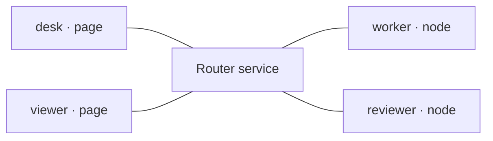

# Connect

## Every client connects to the router, not its peer

After [Configure](./configure.md), authenticate each Node independently to the
central service. These WebSocket connections are not Network permission or proof
of application readiness; there are no direct peer connections.



## Optional existing same-origin browser-session adapter

Opt-in `serve --auth-dir <private-directory>` supports persistent page pairing in
the Router process. Keep auth state/control outside public roots. Private
`pair --auth-dir ... --participant desk` issues a fresh single-use code delivered
out of band, not cached as setup knowledge. The browser submits only that code;
the server binds the fixed configured page identity, without exposing a permanent
token or accepting browser-supplied grants.

```javascript
import {createBrowserSessionAuth} from "/assets/session.js";
import {createMessageRouterClient} from "/assets/client.js";
const auth = createBrowserSessionAuth();
const desk = createMessageRouterClient({onMessage, onResponse});
// Wire these to explicit user controls, not automatic startup:
await auth.pair(privatelySuppliedCode);
const status = await auth.status(); // inert; valid cookie may survive restart
await desk.connectSession(auth.connection(status));
desk.close(); // keep pairing
await auth.forget(); // revoke cookie session, close active socket and clear cookie
```

This uses `/session/ws` with token-free `{v:2,type:'hello'}` and the same routing
client; it has no fallback to a token. It requires the exact authoritative local
HTTP 127.0.0.1 origin and mandatory same-origin cookie WebSocket Origin. Additional
`--origin` settings below apply only to the direct-token path. Cookies are
HttpOnly/SameSite=Strict, not Secure on HTTP or isolated by port; same-origin scripts
and malicious same-user processes remain outside this boundary.

Pairing, Connect, Disconnect and Forget are distinct controls. Check cookie status
and reconnect explicitly after shutdown; restart the owned service and bind the
actual agent session explicitly. Pairing never launches an agent, changes grants
or restores reply/session bindings. A second tab cannot displace the active identity.
Do not replay saved sends/events or revive lost capabilities; preserve the draft
origin/profile. Authentication, destination presence, adapter admission and handling
are separate evidence. See the tool's `docs/local-session.md` for lifetimes, exact
Origin/Host boundaries, private operator commands and revocation. Pairing remains
supported; removal/redesign is deferred. Direct-token/Node integrations below are
independent paths, never an exposed-token fallback.

## The direct credential shape is the same; the provisioning path differs

Use the intended private endpoint record emitted by `serve` after listener startup.
Its token authenticates identity, not an ACL; client `network`/`allow` fields or
knowledge of a destination cannot change central policy. Network membership comes
from configuration, not the hello. Generic `node` may supply `sessionId` as
provenance; `agent` requires it and `page` forbids it.

### Page: desk

```javascript
{
  wsUrl: "ws://127.0.0.1:8787/ws",
  participant: "desk",
  token: "<desk's private token>"
  // No sessionId for a page.
}
```

### Generic Node: worker

```javascript
{
  wsUrl: "ws://127.0.0.1:8787/ws",
  participant: "worker",
  token: "<worker's private token>",
  sessionId: "worker-example" // optional for a generic node
}
```

Node can read its authorized private file; an ordinary browser cannot read that
filesystem path, and the client does not fetch endpoint records automatically.
Both examples construct the same connection fields.

### Provision direct-token browser credentials privately

The page owner must supply only that page's endpoint values into runtime memory,
outside Router delivery and this static guide. Never commit tokens into JS/HTML,
publish endpoint files or add a public token-fetch URL. Without private provisioning
the browser example is not ready to connect. Choose the session adapter above if
permanent browser tokens should stay server-side; do not mix modes or silently
fall back. Generic nodes need no pairing.

## Browser page: desk (or viewer in its own page)

Import the shipped module and relative dependencies in an authorized frontend.
The Router serves `/assets/`; this static guide does not. `--public-root` can serve
a public-safe same-origin frontend, never the repository or private setup directory.

```javascript
import {createMessageRouterClient} from "/assets/client.js";

// Memory-only value provisioned out of band by the page's owner.
// Replace placeholders privately, NOT in a public JS/HTML file.
const deskCredentials = {
  wsUrl: "ws://127.0.0.1:8787/ws",
  participant: "desk",
  token: "<privately supplied desk token>"
};
const desk = createMessageRouterClient({
  onMessage: message => console.log(message.from, message.payload),
  onResponse: response => console.log(response)
});
console.log(await desk.connect(deskCredentials));
// viewer uses its own credential and a separate client in its own context.
```

### Expected connect result

```json
{"v": 2, "type": "hello_ack", "participant": "desk", "kind": "page", "network": "default"}
```

viewer uses its own credential and client in a separate page/context; its one-way
handler sends no reply. Logging in these examples is illustrative, not component
handling; see [Send](./send.md).

Browser Origin must match the Router by default. For a separate frontend, authorize
its exact origin with `--origin http://127.0.0.1:3000` and copy/bundle the modules
there. This guide's CSP and permissions remain unchanged; it never connects.

## Node.js: a generic Node client

Use a Node runtime with built-in WebSocket (for example Node 22+) and run from the checkout root. Save this as a private `.mjs` file in that root or adjust the import path. Set `WORKER_ENDPOINT` to the private worker endpoint file emitted by your owned router.

```javascript
import {readFile} from "node:fs/promises";
import {createMessageRouterClient} from "./.agents/tools/message-router/browser/client.js";

const workerCredentials = {
  ...JSON.parse(await readFile(process.env.WORKER_ENDPOINT, "utf8")),
  sessionId: "worker-example"
};
const worker = createMessageRouterClient({
  onMessage: async message => {
    console.log(message.from, message.payload);
    if (message.expectReply) {
      console.log(await worker.respond(message.id, {answer: "Outline checked"}));
    }
  },
  onResponse: response => console.log(response)
});
console.log(await worker.connect(workerCredentials));
// Keep this process running to receive messages; worker.close() when finished.
// reviewer is a SEPARATE client/process: use its own endpoint + reviewer-example.
```

Expected: `{"v":2,"type":"hello_ack","participant":"worker","kind":"node","network":"work"}`.
`worker-example` illustrates optional provenance; an agent must bind its actual
current session. A second connection cannot displace an already-connected identity.

Run with `WORKER_ENDPOINT=/your/private/endpoints/participants/worker.json node worker-example.mjs`.
reviewer needs a separate client/process, its own `reviewer.json` and provenance;
keep both connected for [Send](./send.md)'s independent initiation example.
**This JavaScript handler receives/emits JSON, not model turns or agent launches.**

## An available agent adapter is an alternative owner of the identity

Use only an installed, exposed adapter with its documented session binding and
admission contract. Consult the mapped tool's adapter documentation for exact
calls and supported delivery modes. Opening a client launches neither a router
nor an agent. Do not also connect the generic Node client with the same identity;
a forwarding receipt alone does not establish admission or model handling.

[Next: inspect permitted destinations →](./discover.md)
