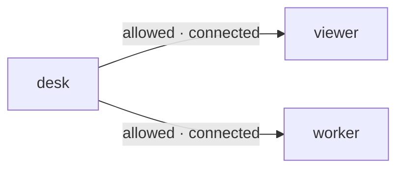

# Discover

## Ask what *this client* may address

`desk.status()` returns destinations permitted by the same central policy used
for routing, with Network and current connection presence. It is not a global
Node directory or reverse-permission query. Explicit blocks are absent even when
same-Network defaults or an allow pair would otherwise permit the destination.

desk's allowed view contains viewer and worker, assumed connected here. The arrows
show permission, not transport:



```javascript
// After the Connect page's desk.connect(...) has completed:
const status = await desk.status();
console.log(status);
```

### Expected result with viewer and worker connected, no pending routes

```json
{
  "v": 2,
  "type": "result",
  "requestId": "<generated status request ID>",
  "status": "connected",
  "participant": "desk",
  "network": "default",
  "destinations": [
    {"id": "viewer", "kind": "page", "network": "default", "connected": true},
    {"id": "worker", "kind": "node", "network": "work", "connected": true}
  ],
  "pending": 0
}
```

Destinations are sorted by ID. reviewer is absent because it belongs to another
Network and desk has no explicit allow to reviewer—even if reviewer is online.
An allowed destination stays listed with `connected: false` when offline.

## Presence is a snapshot, not a delivery guarantee

- `connected` describes a current authenticated router connection, not handler readiness, agent-runtime availability, or model activity. The peer may disconnect before your next send.
- `pending` counts active reply capabilities involving this connection as sender *or* recipient—not queued messages, unread messages, or durable work.
- No tokens, global topology, other participants' grant lists, or history are returned.

Call status when it informs a decision, then choose the intended `to` explicitly.
For an offline allowed destination, follow [failure/reconnection guidance](./failures.md);
status does not queue work or reconnect it.

[Next: independent messages, replies and one-way notifications →](./send.md)
