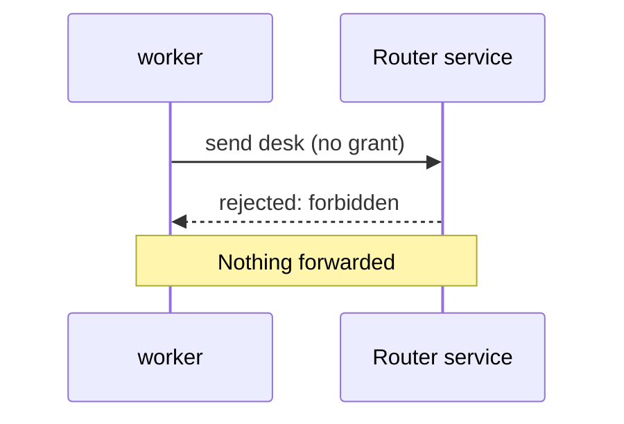
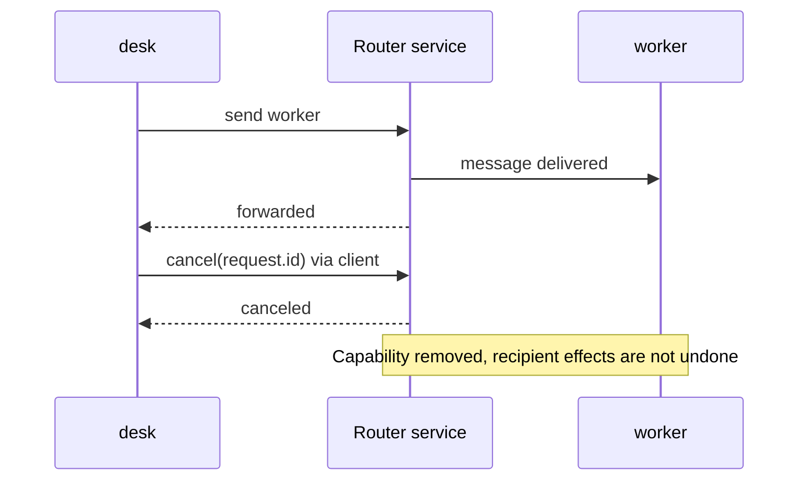

# Handle failures

## Forbidden: central policy denies this direction

worker may reply to a desk request, but cannot start a new worker → desk message:
it crosses Networks without an explicit allow. Explicit blocks also deny, even
within a Network or when an allow pair exists.



```javascript
try {
  await worker.send("desk", {question: "New request"}).accepted;
} catch (error) {
  console.log(error.message); // "forbidden"
}
```

The client rejects `accepted` with an Error. The underlying wire result is `{"v":2,"type":"result","requestId":"<ID>","status":"rejected","error":"forbidden"}`. No forwarding occurs. A return capability does not change central initiation policy.

## Offline: allowed, but no current recipient connection

Close the separately owned viewer client first. desk → viewer remains permitted,
but is not currently deliverable.

```javascript
// In viewer's context:
viewer.close();
// After the router has observed that disconnect, in desk's context:
try {
  await desk.send("viewer", {notice: "Outline changed"}, {expectReply:false}).accepted;
} catch (error) {
  console.log(error.message); // "offline"
}
```

Expected rejection: `error.message === "offline"`. No durable queue retains the message.
Authentication can remain valid while an allowed node is offline. Its later
explicit binding may permit a **new explicit send**; an earlier offline presence
snapshot is not a permanent local send gate. Never replay the rejected/uncertain
request as part of reconnect. This assumes disconnect has reached the Router;
an in-flight emission race can instead be uncertain. status is only a snapshot.

## Cancel correlation, not recipient actions

For this example, temporarily use a worker handler that logs but does not respond. Cancel only after the request has an acknowledged route ID and while it is still pending.



```javascript
const request = desk.send("worker", {question: "Check this outline?"});
const accepted = await request.accepted;
if (accepted.status === "forwarded") {
  console.log(await desk.cancel(request.id));
}
```

Expected while still pending: `{"v":2,"type":"result","requestId":"<cancel RPC ID>","status":"canceled"}`. The argument is the original sender's `request.id`; the result has a new cancellation RPC ID.

Cancel sends no retraction or cancellation event to the recipient. A late recipient response is rejected `unknown_route`. If a final reply wins the race, cancel may instead fail locally with `No acknowledged pending route` or be rejected `unknown_route`; do not claim cancellation succeeded without its result.

## Disconnect or uncertain transport: do not auto-resend

```javascript
// Register when creating desk (or pass as a send onResponse option):
onResponse: response => {
  if (response.type === "route_closed") {
    console.log(response.uncertain, response.reason);
    // Report uncertainty. Do not automatically retry the application action.
  }
}
// When finished with your own client:
desk.close();
```

A remote peer disconnect can emit `{"v":2,"type":"route_closed","id":"<route ID>","requestId":"<sender request ID>","reason":"peer_disconnected","uncertain":true}` to the sender. Local `close()` also invalidates work; its client-generated callbacks have no wire `v` field and use reason `Closed explicitly; delivery uncertain`.

A forwarding result may itself have `status: "uncertain"` rather than rejecting. Check it; a resolved promise is not necessarily `forwarded`. Disconnect, timeout, or a failed write cannot prove the recipient did nothing.

Reconnect explicitly with the authorized identity when appropriate; old reply
capabilities cannot be recovered. [Connect](./connect.md) owns local-session
controls: Disconnect retains pairing; Forget/logout or private operator revocation
removes it and closes active idle sockets. Expiry also closes session sockets,
without undoing forwarded/in-flight effects. A persistent cookie authenticates a
new connection after explicit service restart, not old requests or agent bindings.
Bounded duplicate detection is not exactly-once execution. There is no automatic
reply expiry: final response, explicit cancel or either endpoint's disconnect
releases correlation.

[Return to the configuration and permissions →](./configure.md)
