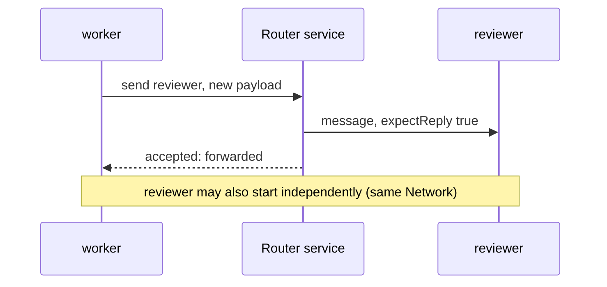
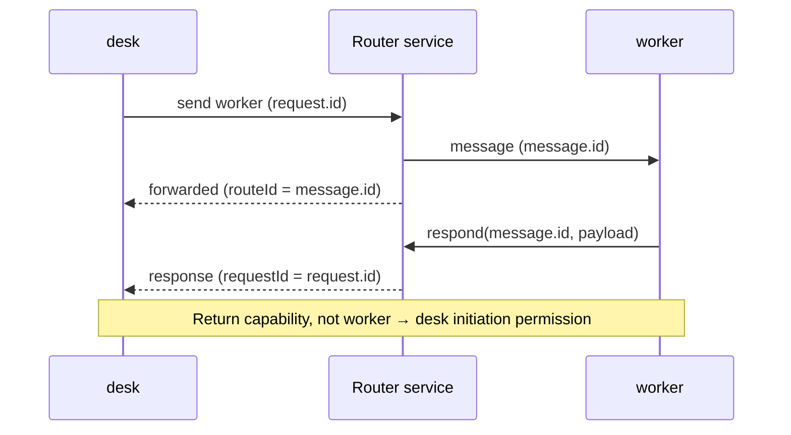
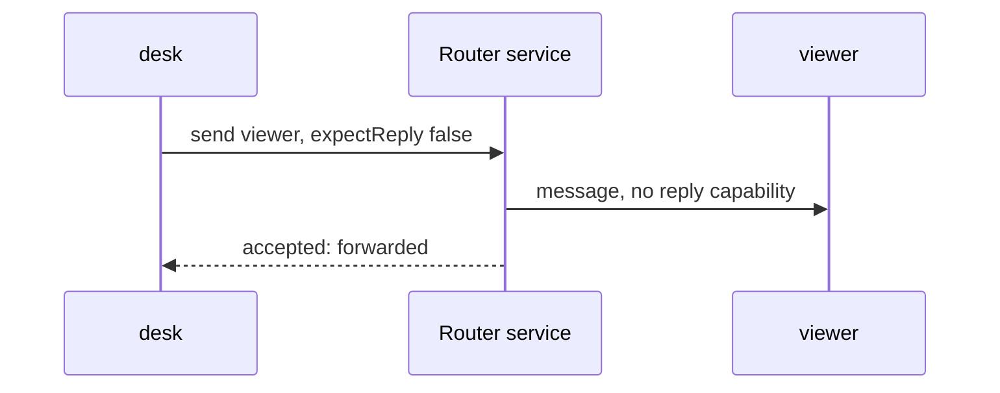

# Send

Examples use the [configured](./configure.md), [connected](./connect.md) clients in
their separate contexts. This guide runs no examples. Use the shipped client's
`send(to, payload, {metadata?, expectReply?, onResponse?})` and
`respond(message.id, payload, {metadata?, final?})`; exact JSON limits and validation
are in the mapped tool's client documentation.

## A new message needs no earlier request

**worker → reviewer** is permitted by their shared `work` Network. Either Node
can start independently under the same-Network default. A physical connection
alone does not grant cross-Network access, and an explicit block would override
this default.



```javascript
// worker context — default expectReply is true
const request = worker.send("reviewer", {question: "Check this outline?"});
console.log(await request.accepted);

// reviewer context — an independent start, not a reply to request
const separate = reviewer.send("worker", {question: "Which section next?"});
console.log(await separate.accepted);
```

### Expected transport result

```json
{
  "v": 2, "type": "result", "requestId": "<sender-generated request ID>",
  "status": "forwarded", "routeId": "<router-generated route ID>"
}
```

`forwarded` means the router emitted the message to the current recipient connection. It does not establish handling, agent admission, or a model answer. A reply-enabled request remains pending until final response, cancel, or disconnect.

## Reply to the received message—not to a participant name

The explicit cross-Network **desk → worker** allow permits the request. worker
can respond through its connection-bound return capability even though a new
**worker → desk** initiation is denied.



```javascript
// Register this handler when creating worker, BEFORE connecting it:
const worker = createMessageRouterClient({
  onMessage: async message => {
    console.log(message.from, message.payload);
    if (message.expectReply) {
      await worker.respond(message.id, {answer: "Outline checked"});
    }
  }
});
await worker.connect(workerCredentials); // private setup from Connect

// In the separately connected desk context:
const request = desk.send("worker", {question: "Check this outline?"}, {
  expectReply: true, // default; explicit here for clarity
  onResponse: response => console.log(response)
});
console.log(request.id);            // sender's correlation ID
console.log(await request.accepted); // transport receipt only
```

### Expected response callback at desk

```json
{
  "v": 2, "type": "response", "id": "<message.id / routeId>",
  "requestId": "<request.id>",
  "from": {"id": "worker", "kind": "node", "network": "work", "sessionId": "worker-example"},
  "payload": {"answer": "Outline checked"}, "metadata": {}, "final": true
}
```

`message.id` is the recipient's route ID, distinct from the sender's `request.id`.
Responses may precede `request.accepted`, so register handling first; the diagram
is not an ordering guarantee. `respond` defaults to `final: true`, releasing the
capability; `final: false` emits an intermediate response. A separate worker → desk
initiation needs an explicit allow without an overriding block.

### Apply replies to the originating component

Register inbound `onMessage` and response `onResponse` (or the per-send handler)
before sending. Validate and apply complete component-owned replies, or represent
failure, rather than merely logging. Multiple components may share a page-owned
client: correlate each request to its originating instance, keep pending states
independent and prevent late replies updating replacements. Page-to-page delivery
also requires a handler that applies the payload; transport provides no shared
application state or component schema.

Separate adapter receipts in `response.metadata.pi` from complete component payload
replies before component validation. Consult the mapped tool's adapter documentation
for delivery options and context-control calls. An exposed agent adapter's reply
operation uses the exact pending inbound ID, not the outgoing request ID.

## No reply requested, no return capability

Send **desk → viewer** with `expectReply: false` when the receiving page needs only a notification.



```javascript
// viewer's onMessage handler may display message.payload; do not respond.
const notification = desk.send("viewer", {notice: "Outline changed"}, {
  expectReply: false
});
console.log(await notification.accepted); // status: "forwarded", not "handled"
```

### Expected recipient event

```json
{
  "v": 2, "type": "message", "id": "<route ID>",
  "from": {"id": "desk", "kind": "page", "network": "default"}, "to": "viewer",
  "payload": {"notice": "Outline changed"}, "metadata": {}, "expectReply": false
}
```

No reply capability is allocated. **Some agent adapters ignore one-way notifications.** Verify the intended recipient's contract and use reply-enabled requests when required; a forwarding receipt alone does not prove admission.

[Next: distinguish failures and uncertainty →](./failures.md)
